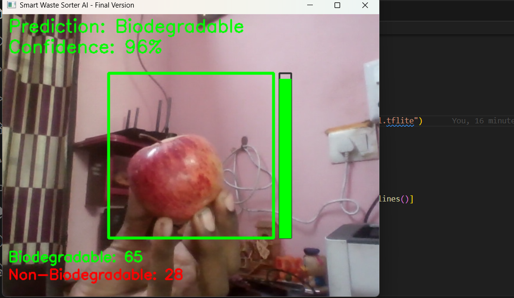
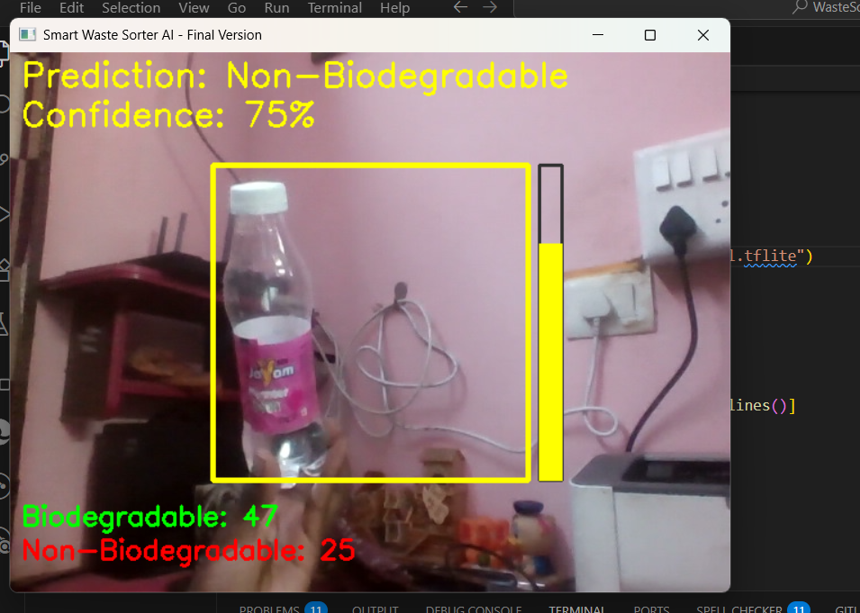

# IoTSmartBin - Real-Time Waste Sorter


A real-time waste classification application that uses a computer's webcam to distinguish between "Biodegradable" and "Non-Biodegradable" items. The project features a smart and interactive UI for clear visual feedback.

This repository contains the software component of a larger IoT Smart Bin concept.

## Features

- **Real-Time Classification:** Classifies objects instantly using a live webcam feed.
- **Custom AI Model:** Powered by a lightweight TensorFlow Lite model trained on a custom dataset using Google's Teachable Machine.
- **Interactive UI:**
    - **Detection Zone:** A central square focuses the classification on the main object and changes color based on confidence.
    - **Confidence Bar:** A vertical bar provides a visual gauge of the model's certainty.
    - **Live Counters:** A dashboard at the bottom keeps a running tally of classified objects.
- **Robust Logic:** Includes a confidence threshold to prevent uncertain guesses and a timeout mechanism to avoid double-counting.

## Screenshots / Demo

Here are some visuals showcasing the application in action:


_Demonstrates classification of a biodegradable item with high confidence._


_Shows classification of a non-biodegradable item and the live counter update._

## Tech Stack

- **Language:** Python
- **AI Framework:** TensorFlow Lite
- **Computer Vision:** OpenCV
- **Numerical Operations:** NumPy
- **Model Training:** [Google's Teachable Machine](https://teachablemachine.withgoogle.com/)

## Setup and Installation

To run this project on your local machine, follow these steps.

**1. Clone the repository:**
```bash
git clone [https://github.com/YOUR_USERNAME/IoTSmartBin.git](https://github.com/YOUR_USERNAME/IoTSmartBin.git)
cd IoTSmartBin
2. Create and activate a virtual environment:

Bash

# For Windows
python -m venv venv
.\venv\Scripts\Activate.ps1

# For macOS / Linux
python3 -m venv venv
source venv/bin/activate
3. Install the required libraries:

Bash

pip install -r requirements.txt
How to Run
With your webcam connected, run the main script from the terminal:

Bash

python recognize.py
Place an item inside the central detection square. Press the 'q' key to exit.

Future Improvements
Hardware Integration: The next step is to connect this software to an Arduino and servo motors to build a physical sorting mechanism, completing the IoT Smart Bin.